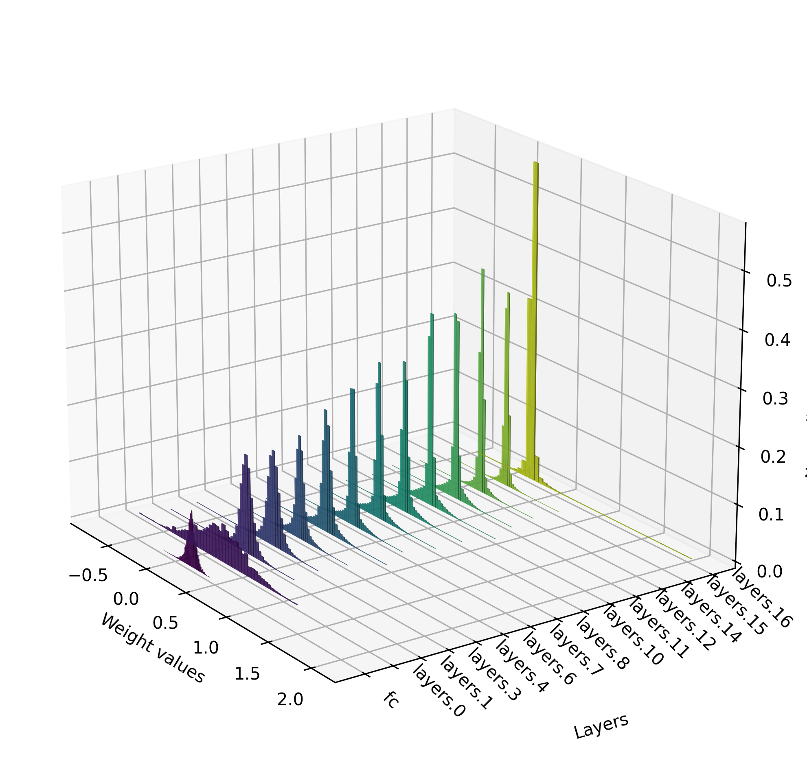
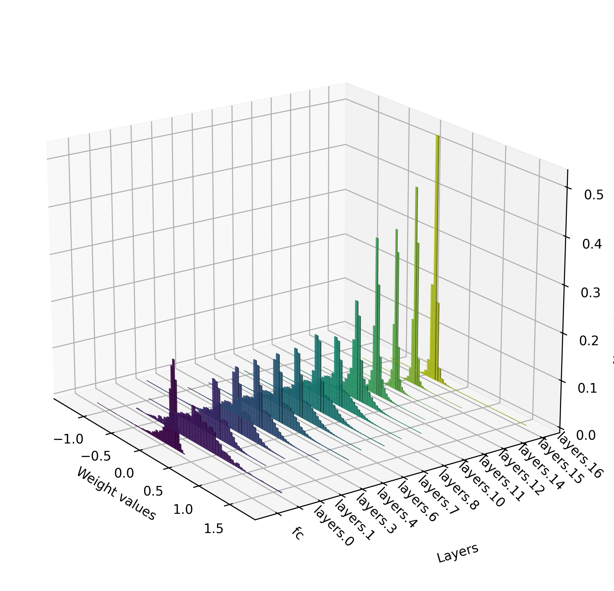
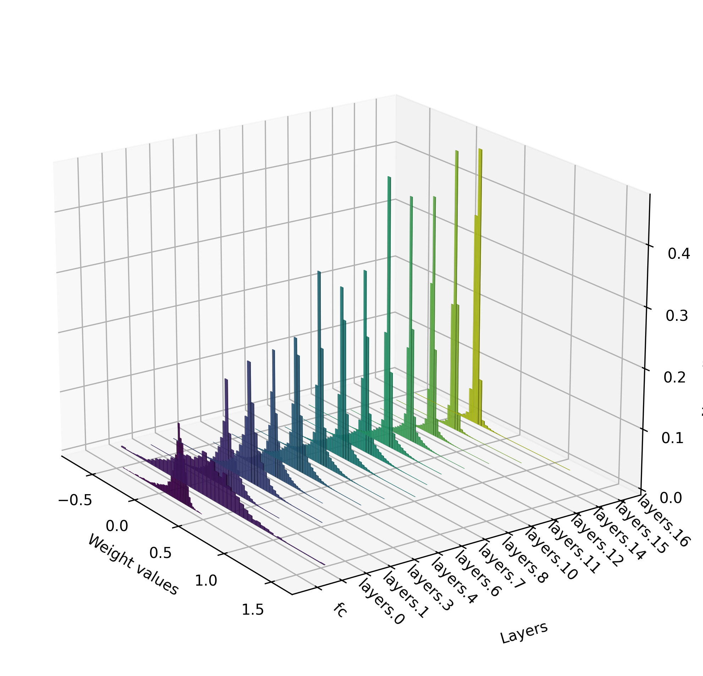
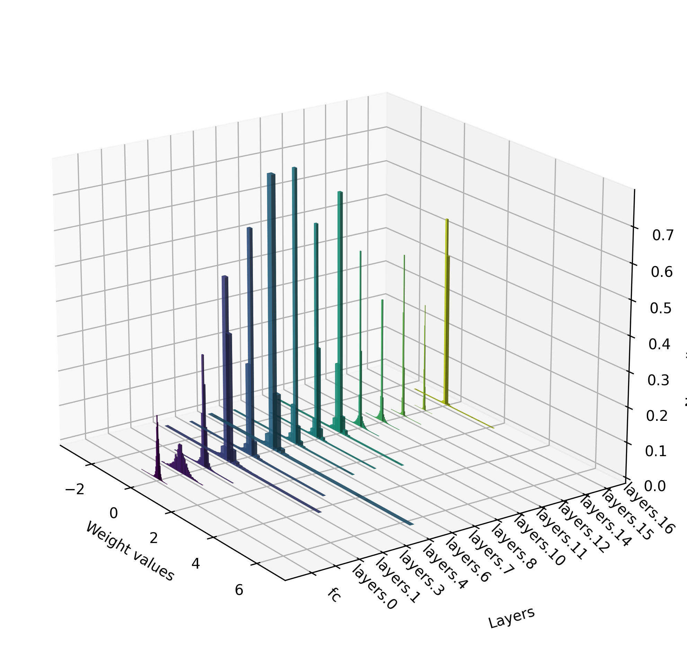

## Assignment 1 : Network Pruning

Yulai Zhao, yz6292  

### 1. Hyper-parameter tuning

#### 1.1 Testing on different archietectures

***Testing accuracy (top 1)***

|   Data  |   Arch |   Rand |  Mag |  SNIP |  GraSP | SynFlow       |   
|----------------|----------------|-------------|-------------|-------------|---------------|----------------|
|Cifar10 | VGG16 | 10.00   |  89.73    |   87.10     |  83.66   |    88.39     |
|MNIST| FC | 95.77   |  97.68    |   96.99     |   95.99   |    11.35     |

On Cifar10 dataset, we use the following commands to run the experiments, especially we only set post-pruning epochs to be 400 for GraSP, and 100 for all other pruners. This is because we observe that GraSP needs more epochs to converge.

```
python main.py --model-class lottery --model vgg16 --dataset cifar10 --experiment singleshot --pruner rand --compression 1 --expid 4 --post-epochs 100
python main.py --model-class lottery --model vgg16 --dataset cifar10 --experiment singleshot --pruner mag --compression 1 --expid 5 --post-epochs 100 --pre-epochs 200
python main.py --model-class lottery --model vgg16 --dataset cifar10 --experiment singleshot --pruner snip --compression 1 --expid 6 --post-epochs 100
python main.py --model-class lottery --model vgg16 --dataset cifar10 --experiment singleshot --pruner grasp  --compression 1 --expid 7 --post-epochs 400 --verbose
python main.py --model-class lottery --model vgg16 --dataset cifar10 --experiment singleshot --pruner synflow --compression 1 --expid 8 --post-epochs 100
```

On MNIST dataset, we use the following commands. Note that SyncFlow is not effective on MNIST dataset even if setting post-pruning epochs to be 150.

```
python main.py --model-class default --model fc --dataset mnist --experiment singleshot --pruner rand --compression 1 --expid 9 --post-epochs 20
python main.py --model-class default --model fc --dataset mnist --experiment singleshot --pruner mag --compression 1 --expid 10 --pre-epochs 20 --post-epochs 10
python main.py --model-class default --model fc --dataset mnist --experiment singleshot --pruner snip --compression 1 --expid 11 --post-epochs 30
python main.py --model-class default --model fc --dataset mnist --experiment singleshot --pruner grasp  --compression 1 --expid 12 --post-epochs 30
python main.py --model-class default --model fc --dataset mnist --experiment singleshot --pruner synflow --compression 1 --expid 13 --post-epochs 150
```

#### 1.2 Tuning compression ratio

Prune models on CIFAR10 with VGG16, please replace {} with sparsity 10^-a for a \in {0.05,0.1,0.2,0.5,1,2}. 

In this subsection, we set post-pruning epochs to be 300 for GraSP, and 100 for all other pruners as well. Other parameters are the same as the previous subsection.


**1.2.1** ***Testing accuracy (top 1)***

|   Compression |   Rand |  Mag |  SNIP |  GraSP | SynFlow       |   
|----------------|-------------|-------------|-------------|---------------|----------------|
| 0.05|  88.08  |  88.69    |   88.20     |  79.03   |     88.05    |
| 0.1|  87.51  |  89.47    |    88.17    |  72.34   |   88.16      |
| 0.2|  88.16  |   89.36   |    87.87    |  78.87    |    88.50     |
| 0.5|  86.80  |  89.95    |    88.55    |  80.86    |     87.14    |
| 1| 10.00   |   88.88   |    87.77    |   81.46   |    87.83     |
| 2|  10.00  |  42.61    |    81.55    |  82.72    |   10.00      |

**1.2.2** ***Testing time (inference on testing dataset)***

|   Compression |   Rand |  Mag |  SNIP |  GraSP | SynFlow       |   
|----------------|-------------|-------------|-------------|---------------|----------------|
| 0.05|  0.608  |  0.658    |  0.583      |  0.624   |    0.828     |
| 0.1| 0.689   |  0.598    |   0.674     | 0.709    |    0.763     |
| 0.2|  0.694  | 0.646     |   0.702     | 0.580     |   0.714      |
| 0.5|  0.613  |  0.700    |  0.672      | 0.609     |    0.714     |
| 1|  0.630  |   0.666   |    0.705    |   0.705   |    0.640     |
| 2|  0.627  |  0.713    |    0.605    |  0.794    |    0.679     |

**1.2.3** ***FLOP***

In the following table, the reported numbers are calculated with: `FLOP / 313478154` where `313478154` is the total FLOP of the unpruned model.

|   Compression |   Rand |  Mag |  SNIP |  GraSP | SynFlow       |  
|----------------|-------------|-------------|-------------|---------------|----------------|
| 0.05|  0.8916  |  0.9477    |     0.9377       | 0.8201    |   0.9488      |
| 0.1| 0.7945   |   0.8991   |    0.9268    | 0.7295    |  0.9026       |
| 0.2|  0.6310  |  0.8151    |    0.7812    | 0.5711     |   0.8217      |
| 0.5| 0.3165   |  0.5634    |    0.4622    | 0.3781     |    0.6423     |
| 1| 0.1009   |  0.2283    |    0.1979    |   0.1751   |    0.4571     |
| 2|  0.0108  |   0.0322   |   0.0411     |   0.0586   |     0.1845    |


### 2. Compression ratio of each layer

#### 2.1 Weight histograms
Report the sparsity of each layer and draw the weight histograms of each layer using pruner Rand |  Mag |  SNIP |  GraSP | SynFlow with the following settings: `model = vgg16`, `dataset=cifar10`, `compression = 0.5`.

In all the figures, the x-axis is the weight value, y-axis is the name of the layer, and the z-axis is the frequency weights in the corresponding bin. Note that we normalize by deviding the total number of weights in each layer.

##### 2.1.1 Rand  


##### 2.1.2  Mag  


##### 2.1.3  SNIP  


##### 2.1.4  GraSP  


##### 2.1.5  SynFlow  


#### 2.2 FLOPs (optional)

Report the FLOP of each layer using pruner Rand |  Mag |  SNIP |  GraSP | SynFlow with the following settings: `model = vgg16`, `dataset=cifar10`, `compression= 0.5`.

|   Layers | Unpruned |  Rand |  Mag |  SNIP |  GraSP | SynFlow       |  
|----------------|----------------|-------------|-------------|-------------|---------------|----------------|
| layers.0.conv| 1769472 |541695  |  1501183    |     1704960       | 985088    |   1765376      |
| layers.1.conv|  37748736  |11867135   |   27796479   |    29917183    | 18281471    |  37137408       |
| layers.3.conv| 18874368   |5992704  |  14198528    |    12952831    | 8534271     |   18300928      |
| layers.4.conv| 37748736  |11856127   |  28079361    |  20818944    | 15328512     |    35502079     |
| layers.6.conv| 18874368  |5943296   |  14003136    |    9233535    |   7212287   |    16645631     |
| layers.7.conv| 37748736  |11949055  |   27708608   |   14927487     |  13233983   |     28944256    |
| layers.8.conv| 37748736  |11956288  |  27095935    |     16215359       | 14178047    |   28932671      |
| layers.10.conv| 18874368   |5974976   |   13638895   |    7740864    | 6951488   |  10316815       |
| layers.11.conv| 37748736 |11935391  |  20104512    |    11484336    | 12541855    |   8774719      |
| layers.12.conv|37748736 |11964463   |  8695023    |    12011791    | 13159455   |    8783952     |
| layers.14.conv| 9437184 |2980576   |   1030796   |    3001123    | 2925716    |  1995555     |
| layers.15.conv| 9437184   |2982560  |  749572    |    2290064    |2429731  |  1996460   |
| layers.16.conv| 9437184  |2982684   |  1139607    |    2320448    | 2471884  |    1982292     |
| fc |  5120    | 1620  | 2201    |    4572    | 2810  |    5107     |


### 3. Summary  

**Compared to baselines.** Although these methods surpass the trivial baseline of random pruning, they do not apparently surpass magnitude pruning after training.

**Accuracy.** No one method is SOTA in all settings and sparsities. SNIP consistently performs well, with SynFlow frequently competitive. Magnitude pruning is surprisingly effective against more complicated heuristics. Especially, for normal sparsities, GraSP performs worst but surprisingly it excels at extreme sparsities (`compression=2`). Overall, the methods generally outperform random pruning; however, they cannot match magnitude
pruning after training in terms of either accuracy or the sparsities at which they match full accuracy.

**Time and FLOP.** SynFlow has the highest FLOP, SNIP and GraSP have low and comparable FLOP. In terms of time, the GPU server I am using is not powerful enough to show the difference in time. Moreover, note that the GPU/CPU communication overhead is affected by other processes, thus I believe the time statistics are not meaningful enough. To have a more accurate time statistics, I think it is essential to send numerous runs on a more powerful server, while trying to avoid simultaneous processes.  

**Layer-wise weight distribution.** Experimentally, we observe that advanced methods tend to prune more in the deeper layers. Specifically, SynFlow has very centered weight distributions, while random pruning has more spread-out weight distributions.

**Layer-wise compression.** The layer-wise sparsity is not consistent across different methods. For example, SynFlow has a higher sparsity in the first layer, while SNIP has a higher sparsity in the last 5 conv layer. This is consistent with the fact that different methods have different heuristics and objectives.